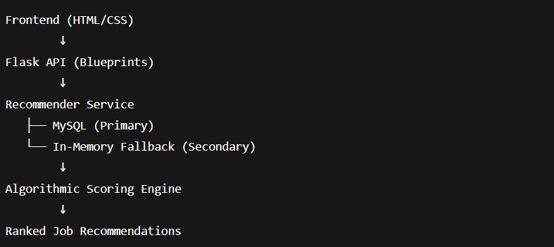
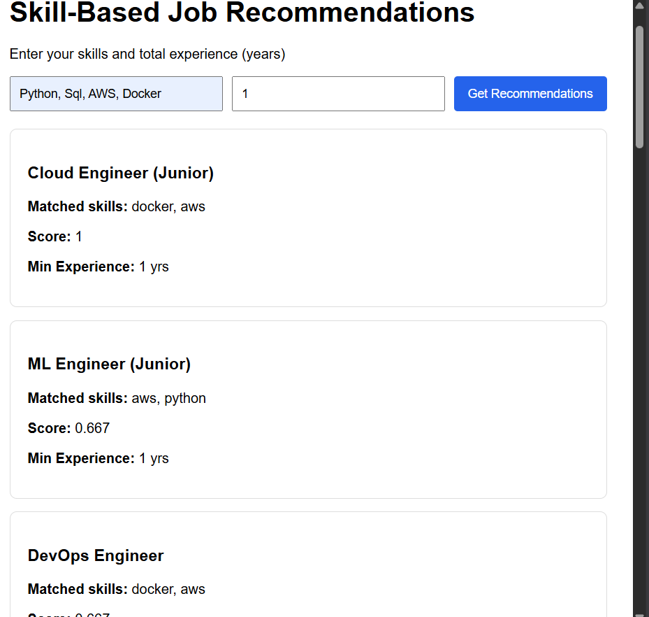

# 🚀 Skill-Based Job Recommendation Engine (LLM-Assisted)

A production-ready skill-based job recommendation system that matches user skills and experience to relevant job roles using algorithmic scoring and SQL queries, with an LLM-powered career advisor for dynamic role guidance and future-proof extensibility.

This project is designed to work reliably both locally and in cloud deployments, using a SQL-first approach with an automatic in-memory fallback when a database is unavailable.

------------------------------------------------
# 🔍 Key Features
✅ Skill-Based Job Matching (Core System)

Matches user-provided skills + experience against predefined job roles.

Uses Data Structures & Algorithm–driven scoring logic (set intersections, normalization, weighted relevance).

Supports experience-based filtering (Intern / Junior / Mid / Senior).

✅ SQL-First with Smart Fallback

Primary data source: MySQL (normalized schema for jobs, skills, job–skill mappings).

Automatic fallback to in-memory dataset if SQL connection fails.

Ensures zero backend errors during free-tier or demo deployments (e.g. Render).

✅ LLM-Powered AI Career Advisor (Groq)

Uses Groq LLM API for dynamic, role-specific career guidance.

Supports:

Predefined roles (Frontend, Backend, ML, DevOps, etc.)

Custom roles (e.g. MLOps, FinOps, Prompt Engineer).

No hardcoded skills — responses are fully LLM-generated.

Gracefully degrades if API key is not configured.

✅ Clean Frontend Interface

Simple HTML/CSS frontend (no heavy frameworks).

Real-time job recommendations.

Interactive AI Career Advisor with dropdown + custom role input.

------------------
🧠 System Architecture

-------------------------------------

LLM Flow:

User Role → Groq LLM → Skill Guidance & Career Advice

# 🗂️ Project Structure

skill-recommendation-engine/
│
├── app/
│   ├── main.py
│   ├── routes/
│   │   ├── recommend.py
│   │   ├── career_advisor.py
│   │   └── health.py
│   ├── services/
│   │   ├── recommender.py
│   │   ├── fallback_data.py
│   │   └── llm_career_advisor.py
│   └── db/
│       └── connection.py
│
├── frontend/
│   ├── templates/
│   │   └── index.html
│   └── static/
│       └── style.css
│
├── scripts/
│   └── seed_data.py
│
├── requirements.txt
├── run.py
└── README.md
-------------------------

# ⚙️ Tech Stack

Backend

Python

Flask (Blueprint-based architecture)

MySQL (SQL queries & schema design)

Algorithmic Scoring Logic (Data Structures)

LLM / AI

Groq LLM API (career advisor)

Prompt-based role analysis (no hardcoding)

Infrastructure

Gunicorn

Render (deployment-ready)

Git & GitHub

GitHub Actions (CI/CD)

Frontend

HTML

CSS

JavaScript (Fetch API)
------------------------------------

# 📊 Recommendation Logic (High-Level)

Normalize user skills.

Fetch matching jobs from SQL (or fallback dataset).

Compute relevance score:

score = matched_skills / total_required_skills

Filter by minimum experience.

Deduplicate results (SQL + fallback).

Sort by score (descending).

# 🤖 AI Career Advisor

Generates:

Core skills

Nice-to-have skills

Beginner learning focus

Common mistakes

Works for any role string, even future roles not present in database.

Example:

MLOps Engineer
FinOps
Prompt Engineer

🔐 Environment Variables

Create a .env file (never commit it):

DB_HOST=localhost
DB_USER=root
DB_PASSWORD=
DB_NAME=skill_recommender

GROQ_API_KEY=your_groq_api_key

If GROQ_API_KEY is missing, the app still works (LLM gracefully disables).

# ▶️ How to Run Locally
pip install -r requirements.txt
python run.py

Open:

http://127.0.0.1:5000
------------------------------------------

# 🚀 Deployment Notes

Designed to deploy on Render free tier without crashes.

SQL failure → automatic fallback → no “backend unreachable” errors.

Gunicorn-compatible WSGI app.
--------------------------------------

